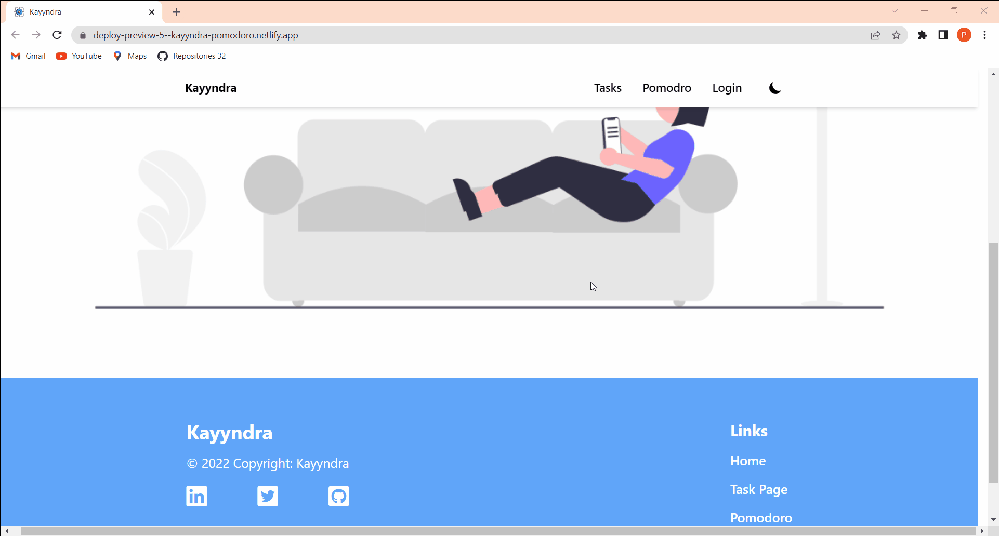

# Kayyndra
<h4 align="center">A Pomodoro app to increase efficiency and focus</h4>

---

## Quick Start

Preview Link : https://kayyndra-pomodoro.netlify.app/

## Run Locally

Clone the project

```bash
  git clone https://github.com/Kavita539/pomodro-app.git
```

Go to the project directory

```bash
  cd pomodro-app
```

Install dependencies

```bash
  npm install
```

Start the server

```bash
  npm run start
```

## Features Available.

- Home Page 
- Tasks Page and Feature
  - Add Task
  - Edit Task
  - Delete Task
  - Mark as Complete
- Pomodoro Feature
  - Add specific Timer
  - use Default Timer
  - Timer according to specific Task
  - Edit Timer
  - Pause Clock
  - Reset Clock
- Authentication
  - Login
  - Sigup
  - Guest Login
- Fully Resposive
- Page title Sync with Pomdoro Time
- Dark Theme Available

---

## Tech Stack

**Client:** React, Tailwind

**Server:** Mockbee.

## 👨‍💻 Connect with me

<a href="https://twitter.com/KavitaP_03"></a>
<a href="https://www.linkedin.com/in/kavita-pathak03/"></a>

---

## Demo




